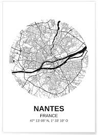

# Carte_Interactive_T_L_A




# Carte interactive
**Mp4 TermD**

Une carte interactive.

**Developed by [Soka7](https://github.com/Soka7), [Yolked64](https://github.com/Yolked64), [tchoupilegoat](https://github.com/tchoupilegoat)**

## ✨Features

## 🚀 Infos

### Basiques
```bash
# Installer les dependances
pip install -r requirements.txt
```

### Référence README pour une lecture (et une correction) agréable.
```bash
https://github.com/mhucka/readmine/blob/main/README.md?plain=1
```